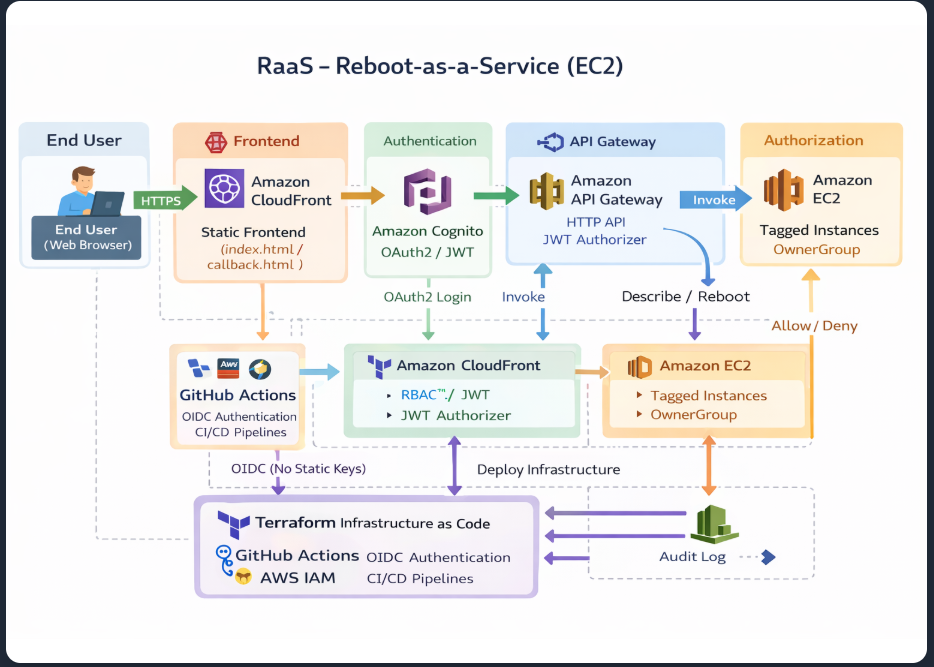

Hi, I'm Raseef Azeez 

Cloud Infrastructure Engineer → DevOps → Cloud Architecture

Cloud Engineer with 5+ years of AWS experience, now focused on building automated, scalable, and resilient cloud-native systems using Terraform, Kubernetes, and modern CI/CD practices.

I enjoy working on systems that don’t just run — but recover, scale, and adapt.
I believe in architecting simplicity in the cloud — understanding systems by asking one “why” at a time.

---

## 🎖 Certifications

---

## 🌐 Connect With Me

---

##  GitHub Stats

  
  

  

---

## 🛠 Tech Stack

---

##  Star Project: RaaS (Reboot as a Service)

A self-service platform built to **reduce operational overhead by automating EC2 lifecycle actions**, inspired by real-world support bottlenecks.

🔗 [Project Link](https://d1l62wn91r29l3.cloudfront.net)
📝 [Deep Dive Article](https://raseefazeez.hashnode.dev/raas-reboot-as-a-service)

--- 

###  Architecture

*Currently replatforming RaaS from Serverless → Kubernetes (RaaS v2)*

---

###  Highlights

* **Security:** Cognito authentication (JWT) + tag-based authorization (ABAC)
* **Automation:** Terraform + GitHub Actions (OIDC, no static credentials)
* **Impact:** Reduces operational overhead and improves response time through secure self-service automation

---

## 📂 Other Projects

### 🔹 Cloud Portfolio Platform

* Serverless architecture using S3, CloudFront, Lambda, and DynamoDB
* 🔗 [View Portfolio](https://d3svccsjj104ji.cloudfront.net)
* 📝 [Read the Build Story](https://raseefazeez.hashnode.dev/how-i-built-my-cloud-portfolio-using-aws-and-github-actions)

---

### 🔹 Kubernetes & CI/CD Lab

* **Kubernetes:** Deployments, Ingress, ConfigMaps (In Progress)
* **CI/CD:** Multi-stage GitHub Actions (Docker build & push)
* **IaC:** Modular Terraform (VPC, IAM, reusable modules)

---

## 📈 Current Focus

* Containerizing **RaaS → Kubernetes** (Minikube / Kind)
* Deepening expertise in **Observability (Prometheus & Grafana)**
* Exploring **multi-cloud deployments**

---

##  Beyond Tech

I believe good engineers don’t just build systems — they **anticipate failure, reduce friction, and design for resilience**.

---

## 📈 Contribution Activity

  

